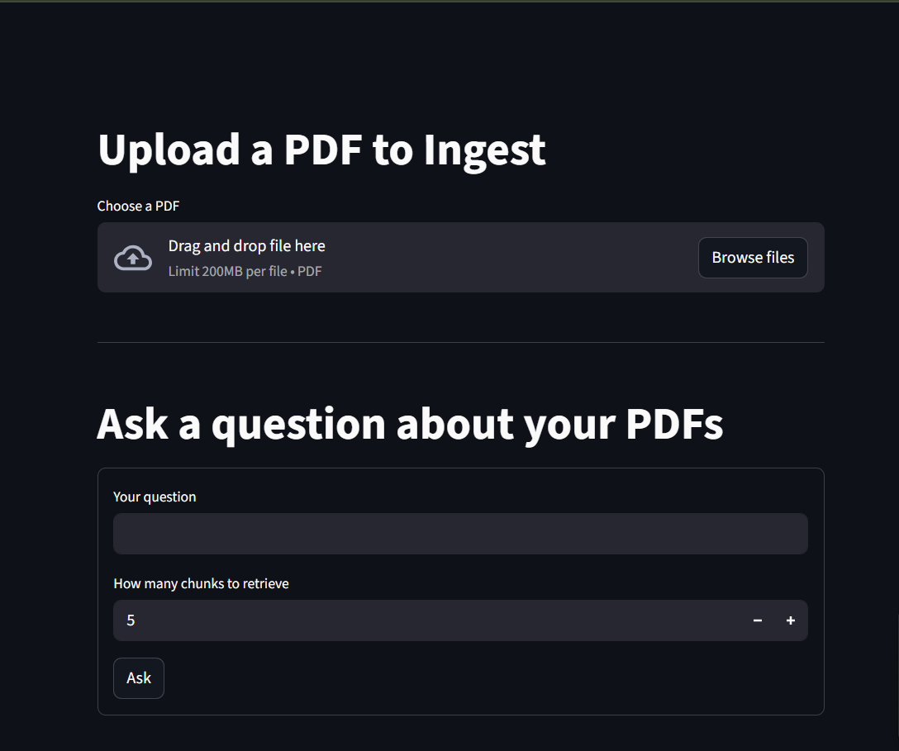

#RAG Python App

Retrieval-Augmented Generation (RAG) application built with Python, featuring a modern Streamlit frontend and robust backend architecture.

## 🚀 Features

- **Document Processing**: Upload and process various document formats
- **Vector Search**: Efficient semantic search using vector embeddings
- **AI-Powered Responses**: Generate intelligent responses using RAG architecture
- **User-Friendly Interface**: Clean and intuitive Streamlit-based UI
- **Production Ready**: Scalable and maintainable code structure

